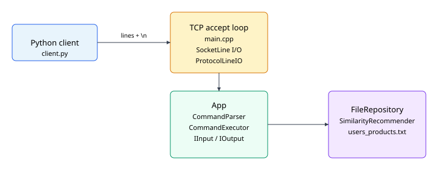
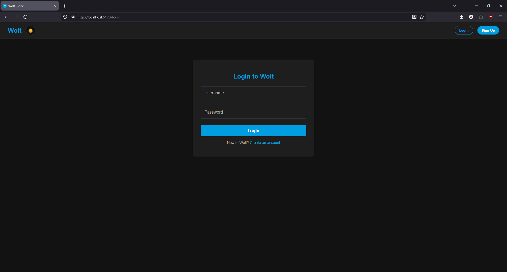
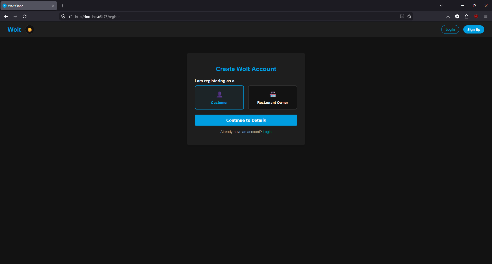
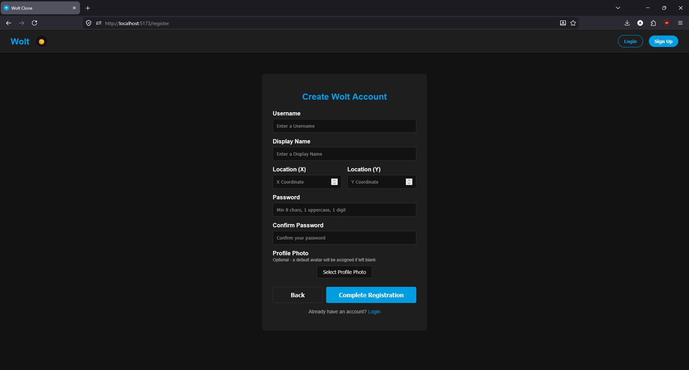
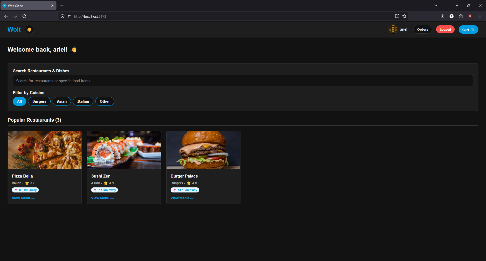
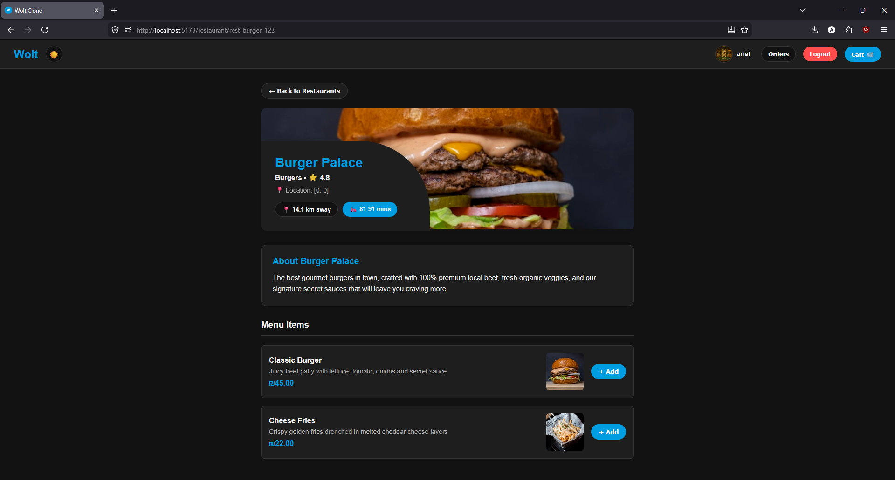
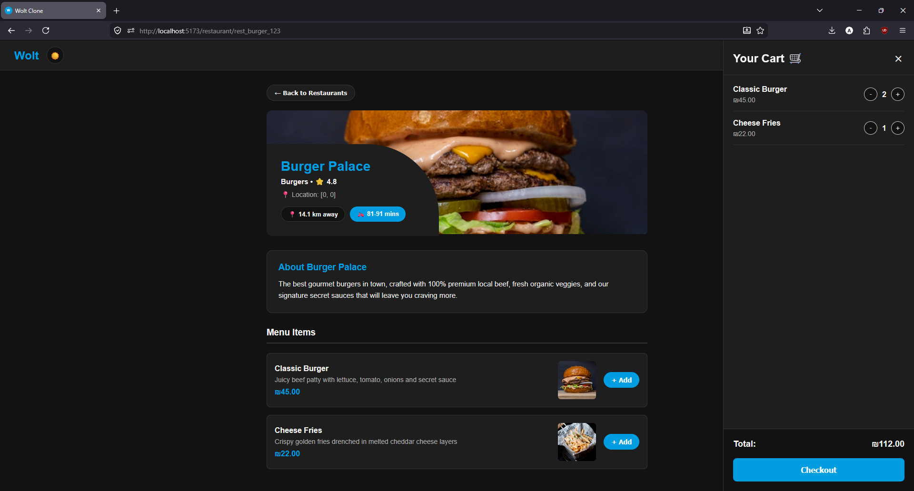
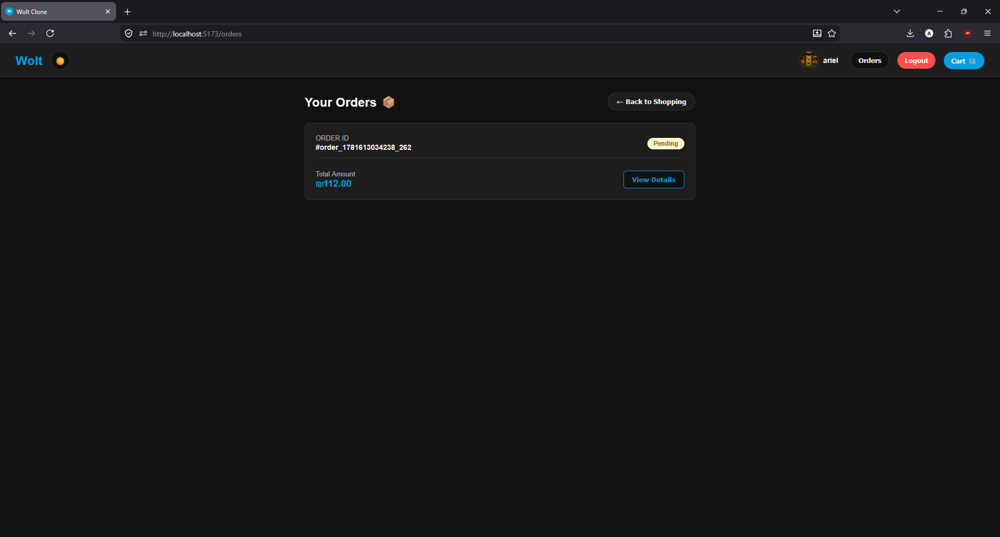

# Advanced Programming Course — Exercise 5

---
## Notes for TA
- Each task's finished product will be pushed to TASK-#tasknum-DONE for your code review. Please note that we will continue merging code in to main branch as a new task is out. We will NOT however merge code in to a specific task branch after due date.
Example: Task 1 code will be presented in a branch named "TASK-1-DONE".
---

This repository contains a **Wolt-style food delivery Full Stack Application** (Exercise 5) built with a **React Web Frontend (Vite)**, a **React Native Mobile App (Expo)**, a **Node.js + Express (MVC) REST API** backed by **MongoDB**, integrated with the **Exercise 2 C++ TCP recommender server**.

- **Web Frontend (Ex4):** React UI built with Vite under `web/client`.
- **Mobile App (Ex5):** React Native (Expo) under `mobile/`.
- **Web API (Ex3/Ex5):** JSON REST under `/api/*`, persistent MongoDB storage via Mongoose.
- **Recommender (Ex2):** Line-based TCP protocol on port `8080`, persisted in `data/users_products.txt`.

For step-by-step setup with screenshots, see the [`wiki/`](wiki/) folder.

---

## General app state

| Component | Location | Role |
|-----------|----------|------|
| Web server | `web/` | Users, tokens, restaurants, products, orders, search (MongoDB via Mongoose) |
| Mobile app | `mobile/` | Expo React Native client (same REST API) |
| MongoDB | Docker `mongo` service / local install | Persistent storage for users, restaurants, products, orders |
| Ex2 server | `src/`, `build/app` | Product-view / recommendation over TCP |
| Ex2 TCP client | `web/services/ex2TcpClient.js` | Web calls Ex2 when a product is viewed |
| Tests (C++) | `tests/` | GTest suite via `tests_runner` |
| Docker | `docker-compose.yml` | Containers for `server`, `web`, `mongo`, `tests`, `client` |

**Implemented API:**

- `POST/GET` `/api/users`, `POST` `/api/tokens`
- Restaurants CRUD + nested products CRUD
- Orders: create, list (logged-in user), get/update/delete by id
- `GET` `/api/search/:query` — case-insensitive match on name/description

**Auth:** `POST /api/tokens` returns a JWT. Send `Authorization: Bearer <token>` on protected routes (orders). Product view still accepts optional `user-id` for Ex2 TCP. Run `./web/scripts/smoke-jwt-auth.sh` to verify route protection.

---

## Architecture

### Exercise 5 — full stack


HTTP clients (React Web + React Native) talk to the Express app via `/api/*`. Data is stored in MongoDB. On **product view**, the web server opens a TCP client connection to the C++ server (fire-and-forget; API still returns JSON immediately).

### Exercise 2 — C++ recommender (detail)



The Python client and C++ server exchange one line per message (`\n`-terminated). `App` drives parsing and execution without knowing about TCP details.

---

## Configuration

Copy the template and adjust locally (do **not** commit `.env`):

```bash
cp .env.example .env
```

| Variable | Default (local) | Purpose |
|----------|-----------------|--------|
| `PORT` | `3000` | Web server listen port |
| `EX2_SERVER_HOST` | `127.0.0.1` | Ex2 TCP host |
| `EX2_SERVER_PORT` | `8080` | Ex2 TCP port |
| `JWT_SECRET` | *(required)* | JWT signing key for login and protected routes |
| `JWT_EXPIRES_IN` | `24h` | JWT token lifetime |
| `MONGODB_URI` | `mongodb://127.0.0.1:27017/wolt` | MongoDB connection string |

The web app reads these via `process.env` (no extra npm packages). For **native local runs**, export variables before starting the web server:

```bash
export $(grep -v '^#' .env | xargs)
```

**Docker:** `docker-compose.yml` loads `.env` and overrides `EX2_SERVER_HOST=server` and `MONGODB_URI=mongodb://mongo:27017/wolt` so the web container reaches services on the compose network.

---

## How to build

### Option 1 — Native (CMake + npm)

**Exercise 2 (C++):**

```bash
cmake -S . -B build
cmake --build build
```

**Exercise 3/5 (web):**

```bash
cd web
npm install
```

**Exercise 5 (mobile):**

```bash
cd mobile
npm install
```

### Option 2 — Docker

```bash
docker compose build
```

| Service | Dockerfile | Purpose |
|---------|------------|---------|
| `server` | `Dockerfile.server` | Build and run `./build/app` |
| `web` | `Dockerfile.web` | Node web API + built React client |
| `mongo` | *(official image)* | MongoDB 7 with named volume |
| `tests` | `Dockerfile.tests` | CMake + `ctest` |
| `client` | `Dockerfile.client` | Python TCP client |

---

## How to run

### Docker (recommended for TA)

Start the full backend stack (C++ server + MongoDB + Express API + built React UI) with one command:

```bash
cp .env.example .env   # if you haven't yet
docker compose up --build server web
```

Starting `web` automatically starts `mongo` and `server` via `depends_on`. MongoDB must become healthy before the web container starts.

| Service | URL / Port |
|---------|------------|
| Web App (React UI & API) | `http://localhost:3000` |
| Ex2 TCP server | `localhost:8080` |
| MongoDB (host access) | `localhost:27018` *(mapped to avoid clash with local MongoDB on 27017)* |

**Expected web startup logs:**

```
MongoDB connected
Seeded N restaurants          # first run only
Web server listening on http://localhost:3000
```

**Verify:**

```bash
curl -i http://localhost:3000/api/health
# Expected: 200 {"status":"ok"}
```

**C++ tests (optional):**

```bash
docker compose run --rm tests
```

**Interactive Ex2 client (optional):**

```bash
docker compose run --rm -it client server 8080
```

---

### Native (Local Development)

For HMR on the web frontend, use **four** terminals (MongoDB is required):

**Terminal 0 — MongoDB:**

```bash
# Homebrew:
brew services start mongodb-community

# Or Docker (standalone):
docker run -d --name wolt-mongo -p 27017:27017 mongo:7
```

**Terminal 1 — Ex2 Server (C++ Recommender):**

```bash
./build/app 8080
```

**Terminal 2 — Web API Server (Node.js):**

```bash
export $(grep -v '^#' .env | xargs)   # from repo root
cd web
npm install
npm start
```

**Terminal 3 — Frontend UI (React + Vite):**

```bash
cd web/client
npm install
npm run dev
```

Open **`http://localhost:5173`**. API calls are proxied to `localhost:3000`.

**C++ unit tests:**

```bash
./build/tests_runner
```

---

### Running the React Native app

The mobile app talks to the same REST API. Start the backend first (Docker or native), then:

```bash
cd mobile
npm install
npm start
```

Press **`i`** for iOS Simulator, **`a`** for Android Emulator, or scan the QR code with Expo Go.

**API base URL** is configured in `mobile/src/services/api.js`:

| Platform | Default URL |
|----------|-------------|
| iOS Simulator | `http://localhost:3000` |
| Android Emulator | `http://10.0.2.2:3000` |
| Physical device | Your computer's LAN IP, e.g. `http://192.168.1.5:3000` |

When using Docker, the backend is still at `localhost:3000` from the host/emulator perspective.

---

## How to use (API examples)

Base URL: `http://localhost:3000/api`

### 1. Health

```bash
curl -i http://localhost:3000/api/health
```

Expected: `200` and `{"status":"ok"}`.

### 2. Register and login

```bash
curl -i -X POST http://localhost:3000/api/users \
  -H "Content-Type: application/json" \
  -d '{"username":"alice","password":"Password1","name":"Alice","profileImage":"data:image/png;base64,..."}'

curl -i -X POST http://localhost:3000/api/tokens \
  -H "Content-Type: application/json" \
  -d '{"username":"alice","password":"Password1"}'
```

Save the `token` from the tokens response for the `Authorization` header.

### 3. Restaurants and menu

```bash
curl -i -X POST http://localhost:3000/api/restaurants \
  -H "Content-Type: application/json" \
  -d '{"name":"Pizza Hub","description":"Wood fired"}'

curl -i http://localhost:3000/api/restaurants

# Replace REST_ID and use returned restaurant id
curl -i -X POST http://localhost:3000/api/restaurants/REST_ID/products \
  -H "Content-Type: application/json" \
  -d '{"name":"Margherita","price":42,"description":"Cheese pizza"}'
```

### 4. View product (triggers Ex2 TCP side-call)

```bash
curl -i http://localhost:3000/api/restaurants/REST_ID/products/PROD_ID \
  -H "user-id: USER_ID_FROM_LOGIN"
```

Expected: `200` with product JSON. Ex2 is notified asynchronously; if Ex2 is down, the API still returns `200` and logs a TCP error on the server console.

### 5. Orders (requires JWT)

```bash
curl -i -X POST http://localhost:3000/api/orders \
  -H "Content-Type: application/json" \
  -H "Authorization: Bearer JWT_FROM_LOGIN" \
  -d '{"restaurantId":"REST_ID","items":[{"productId":"PROD_ID","quantity":1}]}'

curl -i http://localhost:3000/api/orders -H "Authorization: Bearer JWT_FROM_LOGIN"
```

### 6. Search

```bash
curl -i http://localhost:3000/api/search/pizza
```

Expected: `200` with `{"restaurants":[...],"products":[...]}` (case-insensitive).

---

## Project structure (summary)

```
├── src/              # Ex2 C++ recommender + TCP server
├── web/              # Ex3/Ex5 Node.js Express API + React web client
│   ├── client/       # Ex4 Vite React App
├── mobile/           # Ex5 React Native (Expo) app
├── wiki/             # GitHub Wiki source pages (setup, auth, CRUD, orders)
├── tests/            # C++ GTest
├── data/             # Ex2 persistence (runtime)
├── docs/             # Architecture diagrams + screenshots
├── docker-compose.yml
├── .env.example      # Environment template (copy to .env)
└── Dockerfile.*
```

---

## Screenshots

### 1. Login Page


### 2. Registration Role selection


### 3. Registration Page


### 4. Home Page (Restaurants)


### 5. Restaurant Menu Page


### 6. Cart and Order Confirmation


### 7. Orders screen

