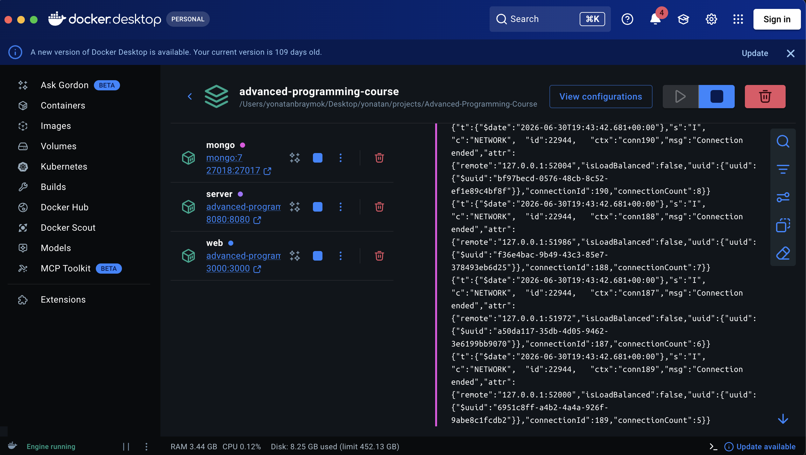
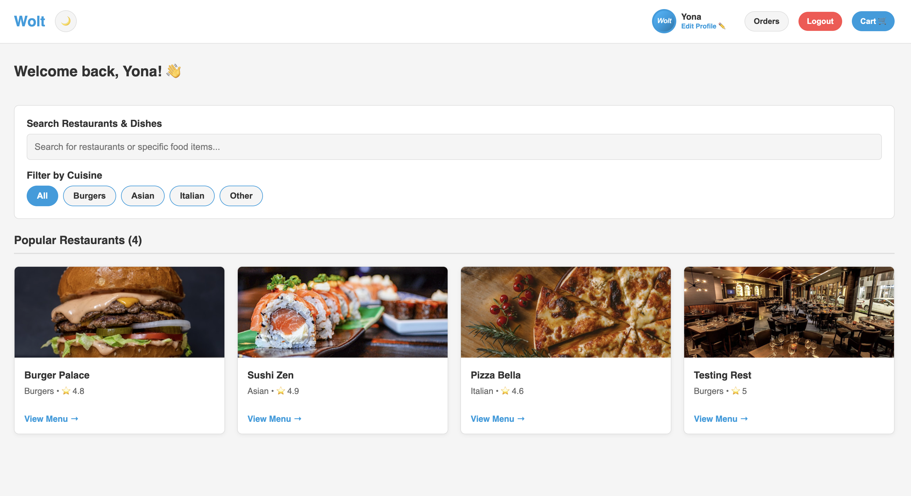

# 01 — Environment setup

How we run the full stack with Docker.

## Prerequisites

- Docker + Docker Compose
- Git
- *(Optional, for mobile)* Node.js 18+, Expo Go

## 1. Clone the repo

```bash
git clone https://github.com/YonatanBraymok/Advanced-Programming-Course
cd Advanced-Programming-Course
```

## 2. Create `.env` (repo root only)

```bash
cp .env.example .env
```

Edit if needed. Defaults work for Docker. **Do not commit `.env`.**

| Variable | Purpose |
|----------|---------|
| `JWT_SECRET` | Required for login |
| `MONGODB_URI` | Overridden to `mongodb://mongo:27017/wolt` inside Docker |
| `EX2_SERVER_HOST` | Overridden to `server` inside Docker |

You only need **one** `.env` at the repo root.

## 3. Start everything

```bash
docker compose up --build server web
```

This starts three services:

| Service | Role |
|---------|------|
| `mongo` | MongoDB 7, data in volume `mongo_data` |
| `server` | C++ recommender on port 8080 |
| `web` | Node API + built React UI on port 3000 |

`web` waits until MongoDB is healthy before connecting.

## 4. Expected terminal output

```
mongo-1   | ... Waiting for connections ...
mongo-1   | ... Healthy
web-1     | MongoDB connected
web-1     | Seeded 4 restaurants          -> first run only
web-1     | Web server listening on http://localhost:3000
```

On later runs you may see `DB already has restaurants, skipping seed` instead.

## 5. Verify

**Health check:**

```bash
curl http://localhost:3000/api/health
```

Expected: `{"status":"ok"}`

**Docker Desktop** — all three containers should be running:



**Web UI** — open http://localhost:3000. You should see seeded restaurants:



## Service URLs

| Service | URL |
|---------|-----|
| Web (UI + API) | http://localhost:3000 |
| C++ TCP | localhost:8080 |
| MongoDB (from host) | localhost:27018 |

Port 27018 avoids clashing with a local MongoDB on 27017.

## Optional: C++ tests

```bash
docker compose run --rm tests
```

## Optional: mobile app

With Docker backend running:

```bash
cd mobile
npm install
npm start
```

API URL defaults are in `mobile/src/services/api.js` (iOS: `localhost:3000`, Android emulator: `10.0.2.2:3000`).

## Troubleshooting

| Problem | Fix |
|---------|-----|
| `FATAL: JWT_SECRET` | Create `.env` from `.env.example` at repo root |
| Port 8080 in use | `lsof -ti :8080 \| xargs kill` then retry |
| Mongo connection failed on first boot | Wait for mongo healthy; compose healthcheck handles this |
| Empty restaurant list | Check web logs for seed message; wipe volume with `docker compose down -v` to re-seed |

Next: [02-auth.md](02-auth.md)
