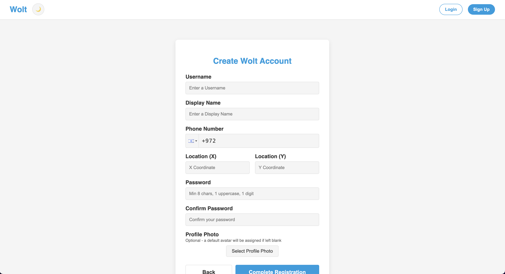
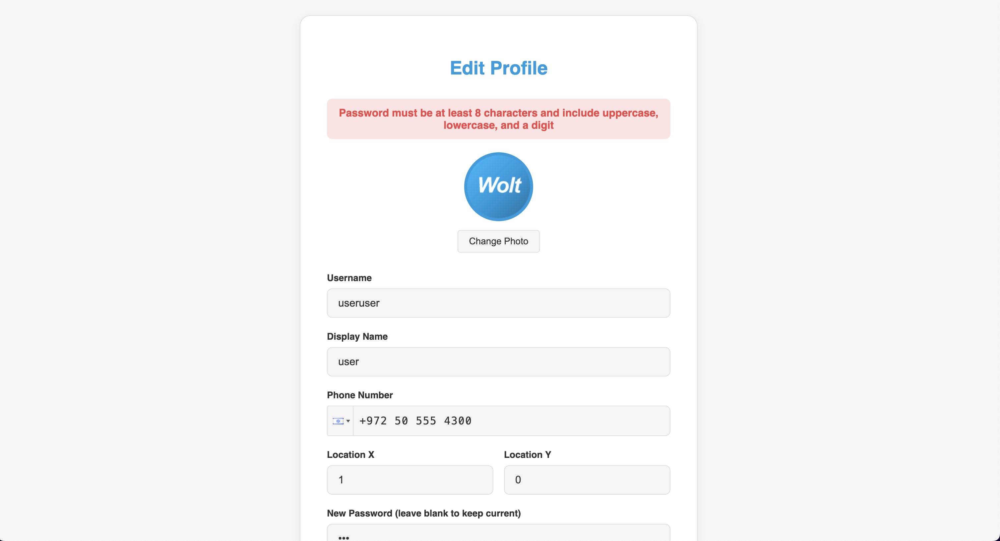
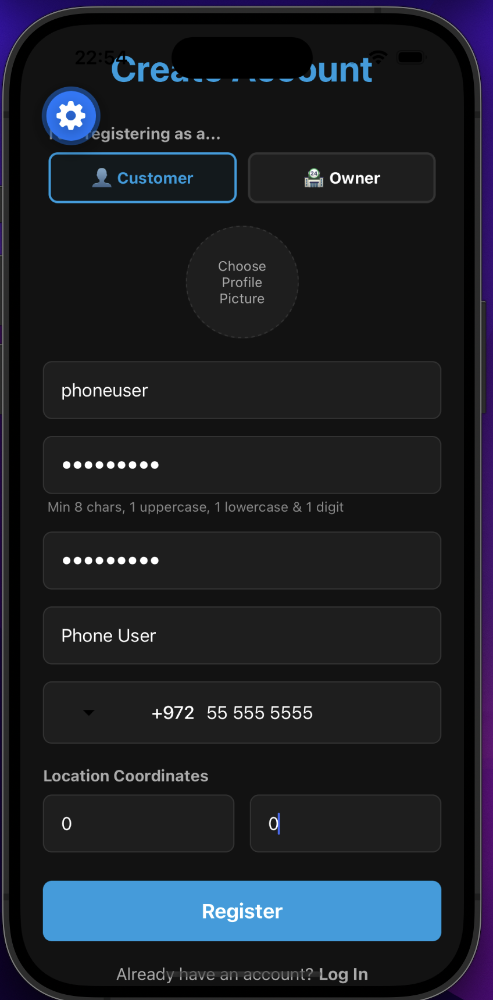
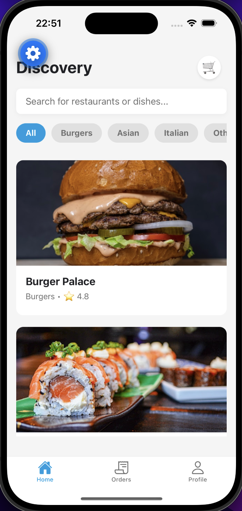
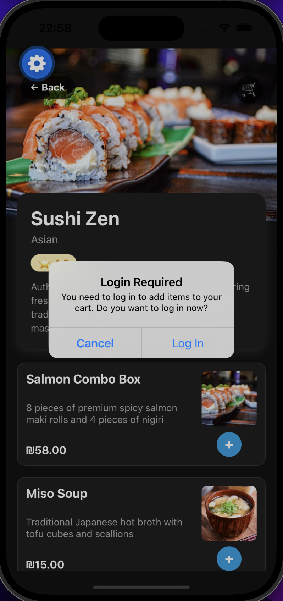
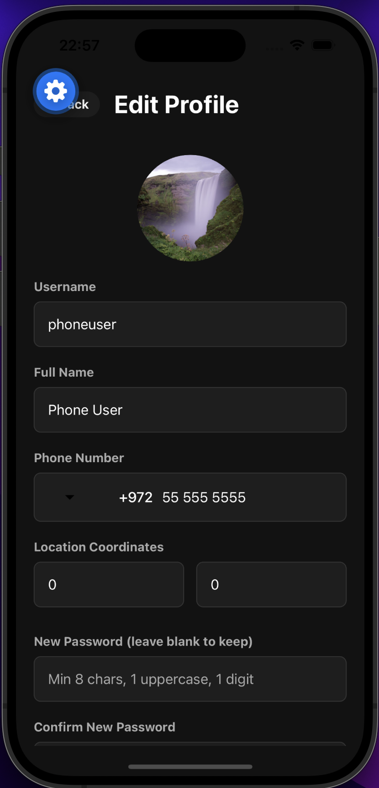

# 02 — Login and registration

Registration and login on **web** and **mobile**. All fields are required. Validation runs before submit.

Password rules (client + server): at least 8 characters, one uppercase, one lowercase, one digit.

---

## Web — register

1. Open http://localhost:3000 and go to **Sign Up**.



The form includes username, display name, phone, location, password, confirm password, and an optional profile photo.

2. On success you are redirected to the login page.

### Validation (web)

Invalid passwords are rejected on register and profile update with an inline error:



Registering a username that already exists returns `409 Conflict`. Wrong login credentials show an error on the login form.

**curl — duplicate username:**

```bash
curl -i -X POST http://localhost:3000/api/users \
  -H "Content-Type: application/json" \
  -d '{"username":"existinguser","password":"Password1","name":"Test","role":"customer"}'
# HTTP/1.1 409 Conflict
```

---

## Web — login

1. Open http://localhost:3000 and go to **Sign In**.
2. Enter username and password, then submit.
3. On success a JWT is stored in `localStorage` and the home page loads.


Logout clears the token. **Orders** and **Cart** in the navbar require a logged-in session.

---

## Mobile — register

1. Open the app and tap **Register** from the login screen.
2. Choose **Customer** or **Owner**, pick a profile photo, fill all fields.



Inline errors appear below each field when validation fails. On success, an alert prompts you to log in.

---

## Mobile — login

1. From the login screen, enter username and password.
2. On success the token is saved in SecureStore and the main tabs open.



Guests can browse restaurants. Adding to cart without logging in shows a prompt:



Logout from **Profile** clears the token and returns to login.

---

## Profile (mobile)

Logged-in users can update their profile and change their photo:



---

## curl examples

**Register:**

```bash
curl -i -X POST http://localhost:3000/api/users \
  -H "Content-Type: application/json" \
  -d '{"username":"demo1","password":"Password1","name":"Demo User","role":"customer"}'
```

**Login:**

```bash
curl -i -X POST http://localhost:3000/api/tokens \
  -H "Content-Type: application/json" \
  -d '{"username":"demo1","password":"Password1"}'
```

Save the `token` from the response for protected routes.

---

Next: [03-crud.md](03-crud.md)
