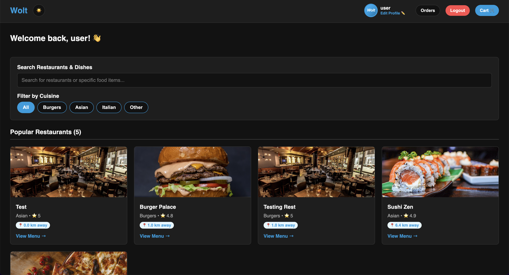
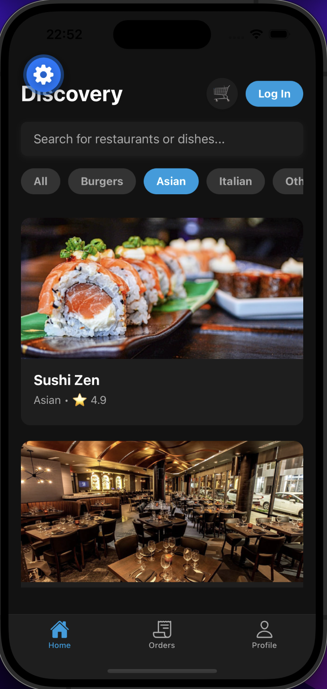
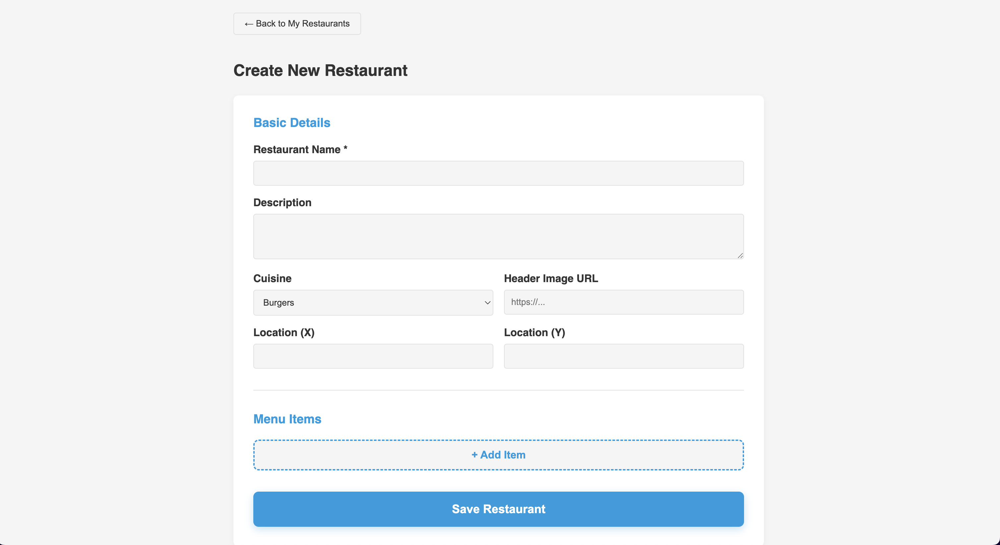
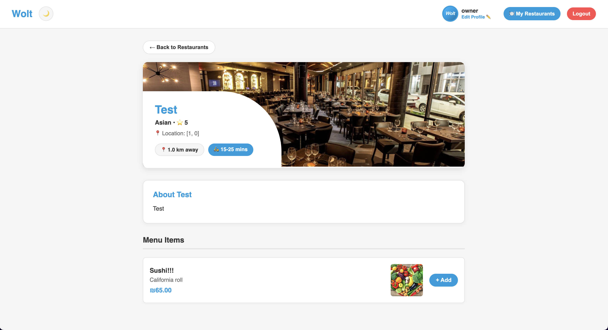

# 03 — Restaurant and product CRUD

Browse, create, edit, and delete restaurants and menu items on web and mobile.

---

## Browse (all users)

Home lists restaurants from `GET /api/restaurants`. Data is seeded on first Docker start from `web/data/restaurants.json`.

**Web:**


**Web dark mode** (toggle in navbar):



**Mobile:**


**Mobile — cuisine filter** (Asian selected, dark mode):



Search uses `GET /api/search/:query` on both clients.

---

## Restaurant CRUD — web (owner)

1. Register/log in as **restaurant_owner**.
2. Open **My Restaurants** from the navbar.
3. **Create** — fill basic details and add menu items.



4. After saving, the restaurant appears on the home page. Open it to view the menu:



Owners can **edit** restaurant details and menu items from the editor, and **delete** from My Restaurants.

**curl — create restaurant:**

```bash
curl -i -X POST http://localhost:3000/api/restaurants \
  -H "Content-Type: application/json" \
  -H "Authorization: Bearer YOUR_JWT" \
  -d '{"name":"Pizza Hub","description":"Wood fired","cuisine":"Italian"}'
```

**curl — delete:**

```bash
curl -i -X DELETE http://localhost:3000/api/restaurants/REST_ID \
  -H "Authorization: Bearer YOUR_JWT"
```

---

## Restaurant CRUD — mobile (owner)

1. Register or log in with role **restaurant_owner**.
2. Use the owner tab bar: **My Restaurants**, **Add Restaurant**, **Profile**.
3. **Create** — tap **Add Restaurant**, enter basic details and menu items inline, then save.
4. **Edit** — open a restaurant from **My Restaurants** and update its details or menu.
5. **Delete** — remove a restaurant from the **My Restaurants** list.

The form matches the web owner editor (name, description, cuisine, and menu rows with **+ Add Item**).

---

## Product / menu items

Products are managed **inside** the restaurant editor:

- **Add** — "+ Add Item" adds a menu row
- **Edit** — change name, price, description in the row
- **Remove** — delete the row before save

See the menu item "Sushi!!!" on the created restaurant page above.

**curl — add product:**

```bash
curl -i -X POST http://localhost:3000/api/restaurants/REST_ID/products \
  -H "Content-Type: application/json" \
  -H "Authorization: Bearer YOUR_JWT" \
  -d '{"name":"Margherita","price":42,"description":"Cheese pizza"}'
```

---

## Orders

Orders are placed from the cart and viewed in Order History. See [04-orders.md](04-orders.md).

Next: [04-orders.md](04-orders.md)
