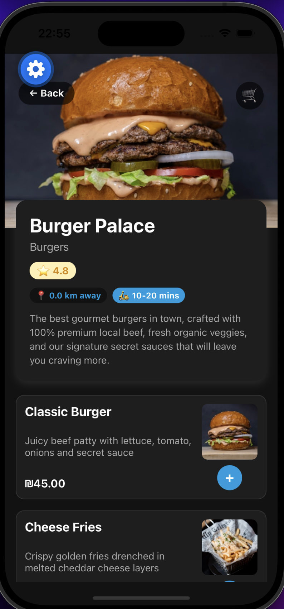
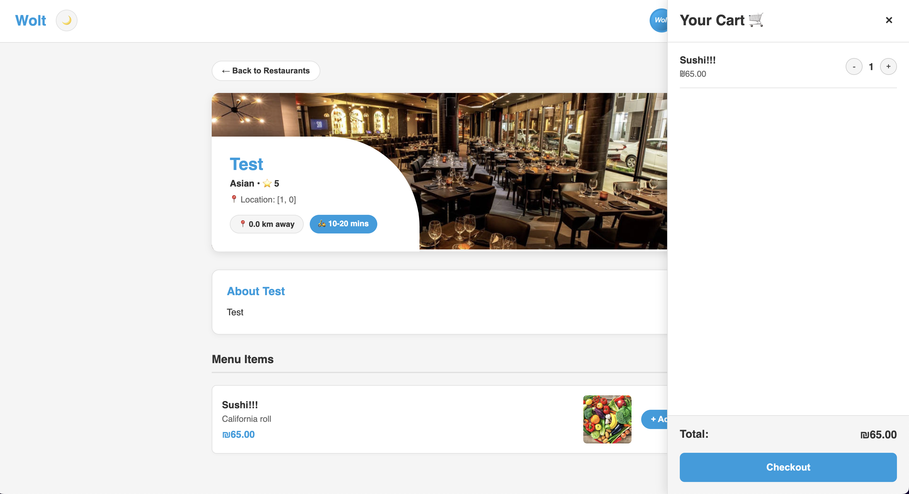
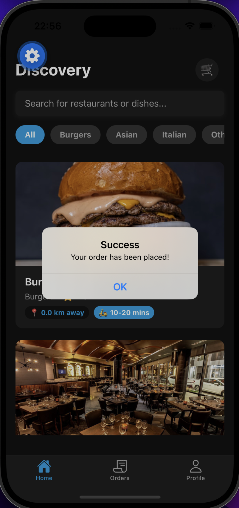
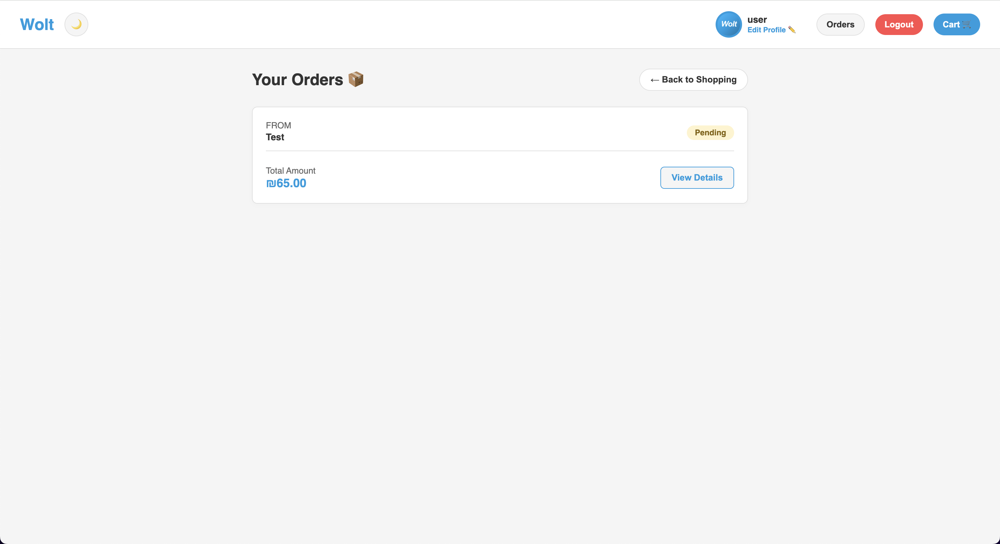
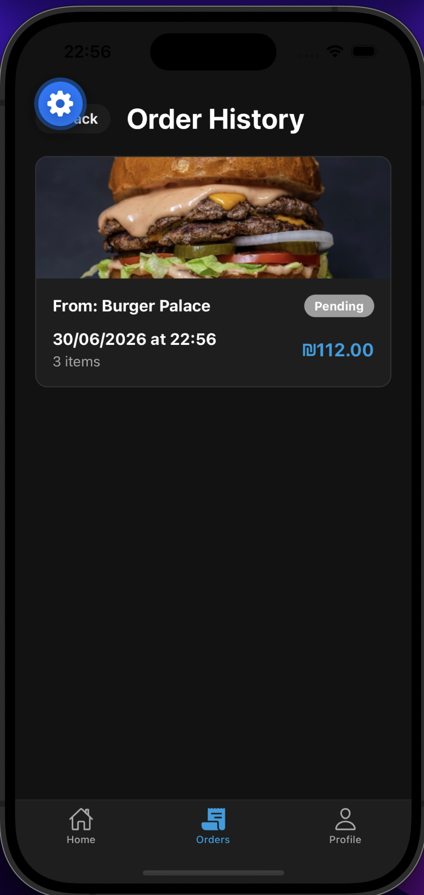

# 04 — Cart and orders

End-to-end order flow on web and mobile.

---

## Flow

```
Home -> Restaurant menu -> Add to cart -> Cart -> Place order -> Order history
```

---

## 1. Browse menu

**Mobile** — open a restaurant and tap **+** on items:



**Web** — same from the restaurant page; menu items have an **+ Add** button.

Only one restaurant per cart. Adding from another restaurant asks to clear the cart first.

Guests on mobile must log in before adding items:


---

## 2. Review cart

**Web** — cart opens as a sidebar:



- **+** / **−** change quantity
- **Checkout** places the order (login required)
- **×** closes the sidebar

**Mobile** — open cart from the header cart icon. Same quantity controls and **Place Order** button.

---

## 3. Place order

You must be **logged in**. After checkout:



**curl:**

```bash
curl -i -X POST http://localhost:3000/api/orders \
  -H "Content-Type: application/json" \
  -H "Authorization: Bearer YOUR_JWT" \
  -d '{
    "restaurantId": "REST_ID",
    "items": [{ "productId": "PROD_ID", "quantity": 2 }]
  }'
```

Without a token -> `401 Unauthorized`.

---

## 4. Order history

**Web** — **Orders** in the navbar:



**Mobile** — **Orders** tab:



Each card shows restaurant, date, status badge, item count, and total. Tap for details.

`GET /api/orders` requires JWT. Orders are sorted newest first.

---

## Order API

**List orders:**

```bash
curl http://localhost:3000/api/orders \
  -H "Authorization: Bearer YOUR_JWT"
```

**Update order status:**

```bash
curl -i -X PATCH http://localhost:3000/api/orders/ORDER_ID \
  -H "Content-Type: application/json" \
  -H "Authorization: Bearer YOUR_JWT" \
  -d '{"status":"confirmed"}'
```

**Delete order:**

```bash
curl -i -X DELETE http://localhost:3000/api/orders/ORDER_ID \
  -H "Authorization: Bearer YOUR_JWT"
```

---

## Persistence

Orders are stored in MongoDB. Restarting Docker keeps data in the `mongo_data` volume.

Back to [README](README.md) | Setup: [01-setup.md](01-setup.md)
